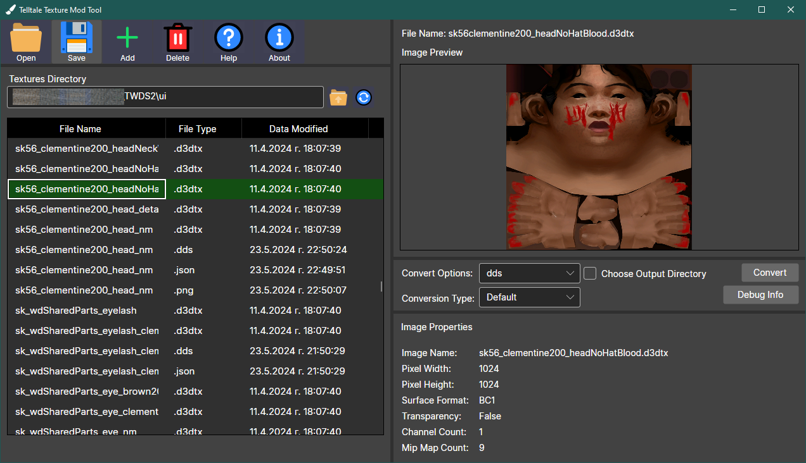

# Telltale Texture Mod Tool

Newer (Fork) Versions:

Older Versions:
  

## Description
This is an application designed to preview and convert **Telltale Tool textures** (files with the **.d3dtx** extension) to a more accessible format like  **DDS (Direct Draw Surface)** and vice versa. There is also support for converting **DDS** to other image formats and back, although this is not recommended due to potential data loss. It works only on **Windows**.

**[DOWNLOAD THE LATEST VERSION HERE](https://github.com/iMrShadow/DDS-D3DTX-Converter/releases)**

## Screenshots

## Getting started

#### [Quick Video Tutorial](https://www.youtube.com/watch?v=pjRhuKe72Qo)

#### [Wiki (WIP)](wiki/home.md)

#### [Outdated wiki, but it still has some relevant information.](https://github.com/Telltale-Modding-Group/DDS-D3DTX-Converter/wiki)

##### If you have issues or questions, redirect them to the [discord server](https://discord.com/invite/HqpnTenqwp).

## Supported Games

- The Walking Dead 
- The Walking Dead: Season Two
- The Walking Dead: Michonne
- The Walking Dead: A New Frontier
- The Walking Dead: The Final Season
- The Walking Dead: The Telltale Definitive Series
- The Walking Dead Collection
- Minecraft: Story Mode
- Minecraft: Story Mode – Season Two
- Sam & Max: The Devil's Playhouse
- Sam & Max: Beyond Time And Space
- Sam & Max: Save The World
- The Wolf Among Us
- Tales from the Borderlands
- Batman: The Telltale Series
- Batman: The Enemy Within
- Guardians of the Galaxy: The Telltale Series 
- Game of Thrones
- Jurassic Park
- Poker Knight 2
- Back to the Future: The Game

#### Supported Texture Layouts

- 2D Textures
- Volume Textures
- Cube Textures
- 2D Array Textures
- Cube Array Textures

## Notes and Limitations
1. This is primarily aimed for PC-platform games. Other platforms are supported in the [beta branch](https://github.com/iMrShadow/DDS-D3DTX-Converter/tree/beta) of this project, but it is not stable enough.
2. Other legacy Telltale titles are supported in the [beta branch](https://github.com/iMrShadow/DDS-D3DTX-Converter/tree/beta), but decrypting is not finished yet.
3. Older games do not support some texture layouts such as volumemaps or cubemaps. Please be cautious.
4. Linux/MacOS are not supported even with Wine due to DirectXTexNet's mixed mode assembly. In the [beta branch](https://github.com/iMrShadow/DDS-D3DTX-Converter/tree/beta) the library is changed to [Hexa.NET.DirectXTex](https://github.com/HexaEngine/Hexa.NET.DirectXTex) which supports Linux and MacOS natively.

## Developers

*Only for modders/developers who plan on forking/modifying/downloading the project.*

There are 3 projects in this repository:
- **DDS_D3DTX_Converter_GUI** is the currently-maintained application with a GUI built with **Avalonia UI**. It has the latest features and improvements. It also has a Debug CLI. 
- **D3DTX_TextureConverter** is a CLI app. It's older than **DDS_D3DTX_Converter_GUI**, which is not recommended to use. It can be still used for some of the latest Telltale games.
- **TextureMod_GUI** is the original GUI application built with **WPF (Mahapps)**. It is not recommended to use as it's extremely outdated.

We utilize [DirectXTexNet](https://github.com/deng0/DirectXTexNet), a .NET wrapper around [DirectXTex](https://github.com/microsoft/DirectXTex), allowing us to work better with DDS files.

If you want to use the console applications, you can open their relative solutions in Visual Studio. It would require you to change the code to set some parameters.

**If you want to learn about the D3DTX file format** we suggest you looking in the **DDS_D3DTX_Converter_GUI** project at **[TelltaleD3DTX folder](/DDS_D3DTX_Converter_GUI/DDS_D3DTX_Converter/Telltale/TelltaleD3DTX)**. The classes there are well documented and describe the D3DTX format. Preferably, start with D3DTX_V9.cs and go upwards.
**Direct Surface Draw (.dds)** is a Microsoft file format, which is described in detail [here](https://learn.microsoft.com/en-us/windows/win32/direct3ddds/dx-graphics-dds). You can also check out in [this folder](DDS_D3DTX_Converter_GUI/DDS_D3DTX_Converter/DirectX) the following classes:
- DDS_HEADER.cs
- DDS_HEADER_DX10.cs
- DDS_PIXELFORMAT.cs

## Credits
- Thanks to [David Matos](https://github.com/frostbone25) for his original work on the old converter and its wikipedia. 
- Thanks to [Ivan Panayotov](https://github.com/iMrShadow) for creating the new GUI, adding support for more games and possibly all textures from **Back to the Future: The Game (2010)** and onwards. 
- Thanks to [Mawrak](https://github.com/Mawrak) for their work on the original GUI application and its wiki, testing the software and providing critical feedback.
- Thanks to [Lucas Saragosa](https://github.com/LucasSaragosa) for figuring out the Telltale formats and for his help for parsing the D3DTX correctly for all supported games. His [TelltaleToolLib](https://github.com/LucasSaragosa/TelltaleToolLib) project served as a reference, which had a lot of influence in the conversion process.
- Thanks to [Arrizble](https://www.youtube.com/@arizzble2005) for creating a tutorial, testing the software on **Minecraft: Story mode** series and providing critical feedback.
- Thanks to [Knollad Knolladious](https://github.com/LBPHaxMods) for testing the software on **Minecraft: Story mode** series. Array textures support was added due to his discoveries.
- Thanks to the [DirectXTexNet's](https://github.com/deng0/DirectXTexNet) authors for providing an amazing wrapper.
- Thanks to [SVG Repo](https://www.svgrepo.com/) for their amazing GUI icons.

#### Current Developer Note
*Special thanks to David for introducing me to the Telltale Modding Community and modding as a whole, and for being a good mentor along the way.
Special thanks to Lucas for helping me add support for older games and made me understand the Telltale Tool Engine better.*
