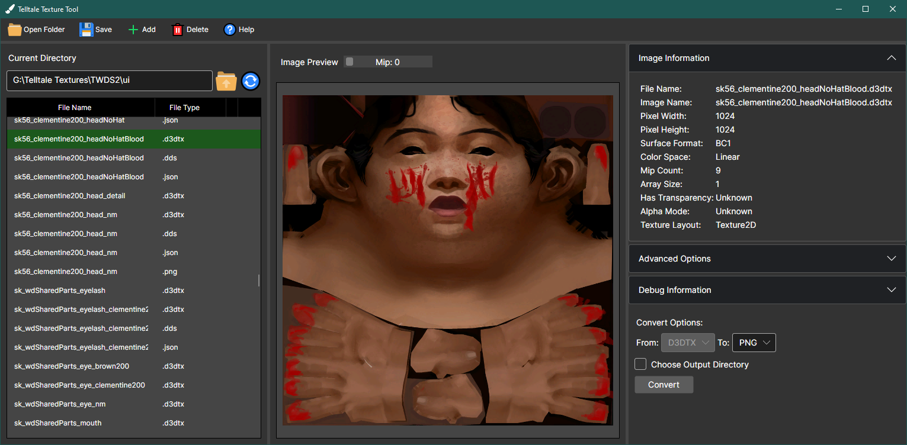

# Telltale Texture Tool

 

Newer (Fork) Versions:

Older Versions:
  

## Description
This is an application designed to preview and convert **Telltale textures** (files with the **.d3dtx** extension) to more accessible formats like **PNG**, **JPEG**, **DDS**, **TGA**, **HDR**, **TIFF**, **BMP** and vice versa.

**[DOWNLOAD THE LATEST VERSION HERE](https://github.com/iMrShadow/DDS-D3DTX-Converter/releases)**

## Screenshots

## Getting started

#### [Quick Video Tutorial](https://www.youtube.com/watch?v=pjRhuKe72Qo)

#### [Documentation (WIP)](Docs/home.md)

#### [Outdated wiki, but it still has some relevant information.](https://github.com/Telltale-Modding-Group/DDS-D3DTX-Converter/wiki)

##### If you have issues or questions, redirect them to the [discord server](https://discord.com/invite/HqpnTenqwp).

## Supported Games

- The Walking Dead 
- The Walking Dead: Season Two
- The Walking Dead: Michonne
- The Walking Dead: A New Frontier
- The Walking Dead: The Final Season
- The Walking Dead: The Telltale Definitive Series
- The Walking Dead Collection
- Minecraft: Story Mode
- Minecraft: Story Mode – Season Two
- The Wolf Among Us
- Sam and Max Save the World Remastered
- Sam and Max Beyond Time and Space Remastered
- Sam and Max The Devil’s playhouse Remastered
- Sam & Max Save the World
- Sam & Max Beyond Time and Space
- Sam & Max: The Devil’s Playhouse
- Tales from the Borderlands
- Batman: The Telltale Series
- Batman: The Enemy Within
- Guardians of the Galaxy: The Telltale Series 
- Game of Thrones
- Jurassic Park
- Back to the Future: The Game
- Hector: Badge of Carnage
- Telltale Texas Hold’em
- Bone: Out from Boneville
- Bone: The Great Cow Race
- Strong Bad’s Cool Game for Attractive People
- Wallace & Gromit’s Grand Adventures
- Tales of Monkey Island
- Hector: Badge of Carnage
- Nelson Tethers: Puzzle Agent
- Puzzle Agent 2
- Poker Night at the Inventory
- Poker Knight 2
- CSI: 3 Dimensions of Murder
- CSI: Hard Evidence
- CSI: Deadly Intent
- CSI: Fatal Conspiracy
- Law & Order: Legacies

## Supported Platforms:
- PS3
- PS Vita
- PS4
- Nintendo Switch
- Xbox 360
- Android
- iOS

## Notes and Limitations

1. This is primarily aimed for PC-platform games. There is some support for console and mobile platforms. More information can be found in the documentation.
2. It does not decrypt textures, please use `Telltale Explorer` to get the decrypted ones.
3. MacOS support is not tested. Please report any issues!

## Developers

*Only for modders/developers who plan on forking/modifying/downloading the project.*

There are 3 projects in this repository:
- **TelltaleTextureTool** is the currently-maintained application with a GUI built with **Avalonia UI**. It has the latest features and improvements.

The other 2 projects are located in the Archive folder.
- **D3DTX_TextureConverter** is an older CLI app version of the tool, which is not recommended to use. It can be still used for some of the latest Telltale games.
- **TextureMod_GUI** is the original GUI application built with **WPF (Mahapps)**. It is not recommended to use as it's extremely outdated.

We utilize [`Hexa.NET.DirectXTex`](https://github.com/HexaEngine/Hexa.NET.DirectXTex), a .NET wrapper of [`DirectXTex`](https://github.com/microsoft/DirectXTex), allowing us to work better with texture files.

v2.5.0 will not have a CLI version, while v2.4.0 does support it.

**If you want to learn about the `D3DTX` file format** we suggest you looking [here](https://github.com/iMrShadow/DDS-D3DTX-Converter/tree/main/TelltaleTextureTool/TelltaleTextureTool/Telltale/FileTypes/D3DTX/Versions). The classes there are well documented and describe the D3DTX format. Preferably, start with D3DTX_V9.cs and go upwards. There is also [the official documentation](/Docs/home.md).
**Direct Surface Draw (.dds)** is a Microsoft file format, which is described in detail [here](https://learn.microsoft.com/en-us/windows/win32/direct3ddds/dx-graphics-dds).

## Credits
- Thanks to [Ivan Panayotov](https://github.com/iMrShadow) for creating the new GUI and its features, adding support for possibly all games, which include mobile and console platforms, and creating the new documentation.
- Thanks to [David Matos](https://github.com/frostbone25) for his original work on the old converter and its wikipedia. 
- Thanks to [Mawrak](https://github.com/Mawrak) for their work on the original GUI application and its wiki, testing the software and providing critical feedback.
- Thanks to [Lucas Saragosa](https://github.com/LucasSaragosa) for figuring out the Telltale formats and for his help for parsing the `D3DTX` correctly for all supported games. His [TelltaleToolLib](https://github.com/LucasSaragosa/TelltaleToolLib) project served as a reference, which had a lot of influence in the conversion process.
- Thanks to [Knollad Knolladious](https://github.com/LBPHaxMods) for his outstanding feedback, research and knowledge. His discoveries from **Minecraft: Story mode** series led to support other texture layouts, console and mobile platforms, as well as many other things.
- Thanks to [Arrizble](https://www.youtube.com/@arizzble2005) for creating a tutorial, testing the software on **Minecraft: Story mode** series and providing critical feedback.
- Thanks to [Juna Meinhold](https://github.com/JunaMeinhold) for their cross-platform DirectXTex wrapper.
- Thanks to the [DirectXTexNet's](https://github.com/deng0/DirectXTexNet) authors for providing an amazing stable and reliable wrapper.
- Thanks to [Chuck Walbourn](https://github.com/walbourn) for DirectXTex and adding support for obsolete Direct3D9 formats, which are used by older Telltale games.
- Thanks to [SVG Repo](https://www.svgrepo.com/) for their amazing GUI icons.

#### Current Developer Note
*Special thanks to David for introducing me to the Telltale Modding Community and modding as a whole, and for being a good mentor along the way.
Special thanks to Lucas for helping me add support for older games and made me understand the Telltale Tool Engine better.*
