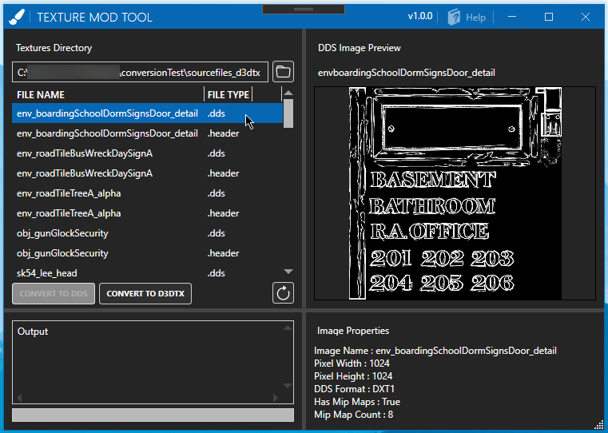

# Texture Mod Tool

This is a application designed for converting **.d3dtx textures (Telltale Tool Textures)**, to standard **.dds (Direct Draw Surface)**. **It can also do the opposite and can be used to do texture mods for a Telltale Tool Game.** 

**If there are any issues PLEASE report them to [HERE](https://github.com/Telltale-Modding-Group/DDS-D3DTX-Converter/issues)**

## DISCLAIMER (Please Read)

**NOTE:** Not all .d3dtx textures will work or show up properly and might even look corrupted after conversion. This is simply because once again, this is very new and I have yet to support more d3dtx texture variants. For the most part, any regular diffuse/albedo textures should work.

This is currently being developed and tested only with ***"The Walking Dead Telltale Definitive Series"*** textures. (for the time being)

### Limitations

1. Only supports The Walking Dead Definitive Edition textures (for the time being)
2. Can't upscale or downscale the texture resolution (for the time being)
3. Not all textures are supported, textures like **'specular maps'** *(some of them)*, **'ink maps'**, **'normal maps'** *(some of them)* may not be converted by the tool properly. However the majority of the regular color/diffuse/albedo textures should be supported.

## How to use?

still writing...
